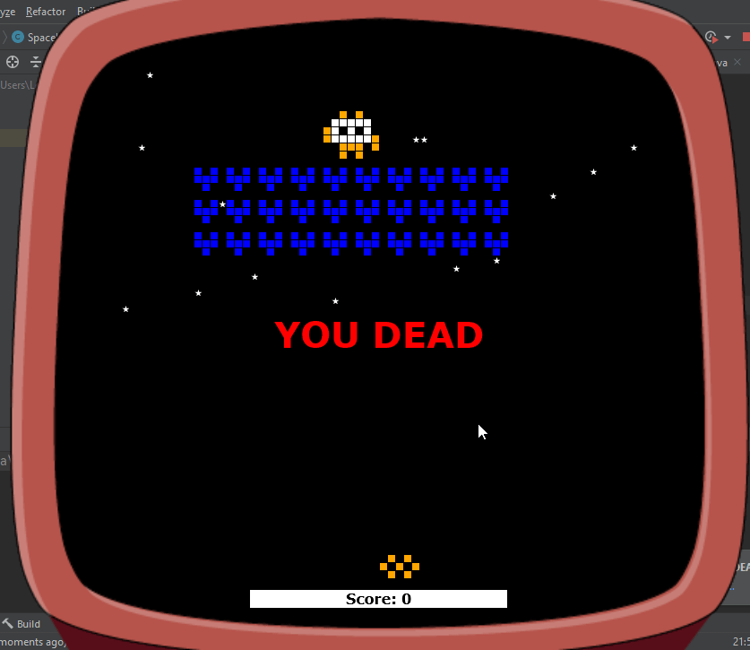

# Game Space Invaders
Space Invaders 2D - simple Java Game

## Table of contents
* [General info](#general-info)
* [Technologies](#technologies)
* [Setup](#setup)
* [View](#view)

## General info
Space Invaders is a 2D game written in Java.  
The goal of the game is to confront a squad of alien invaders. 
The fight takes place in outer space.  
To win, the player must destroy all enemy ships, including the boss (the leader of the invaders). 
At the same time, the player has to dodge enemy bullets..  

## Technologies
Project created with:
* Java: 1.8
* lib: desktop-game-engine.jar
	
## Setup
To run this project, create a simple java application and copy the source code.  
Download the desktop-game-engine.jar.  
Then add the downloaded .jar file to your IDE in the library section.

## View
When the application is started, space and enemies appear on the gameboard.
The player goal is to destroy the enemy squad using keyboard buttons:
* LEFT arrow (for move left side)
* RIGHT arrow (for move right side)
* SPACE button (for shooting)

Be careful avoid all bullets!    

  
